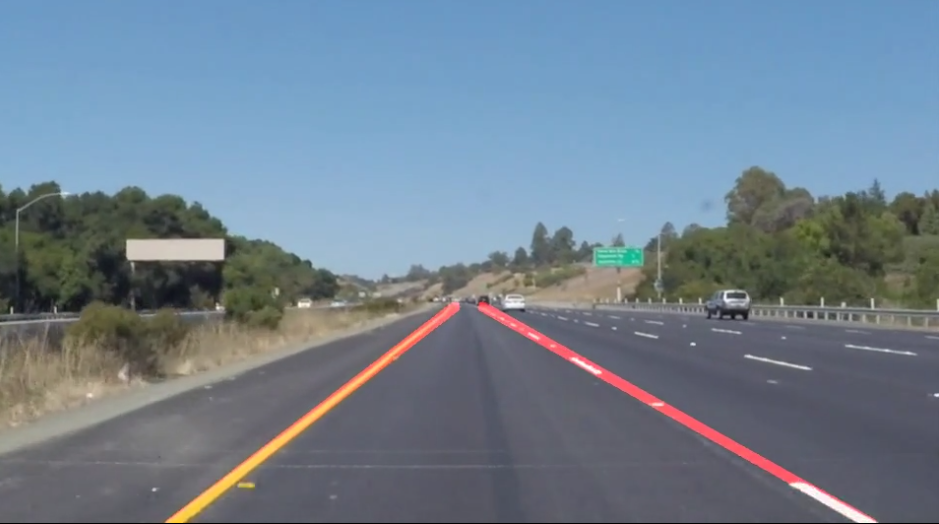
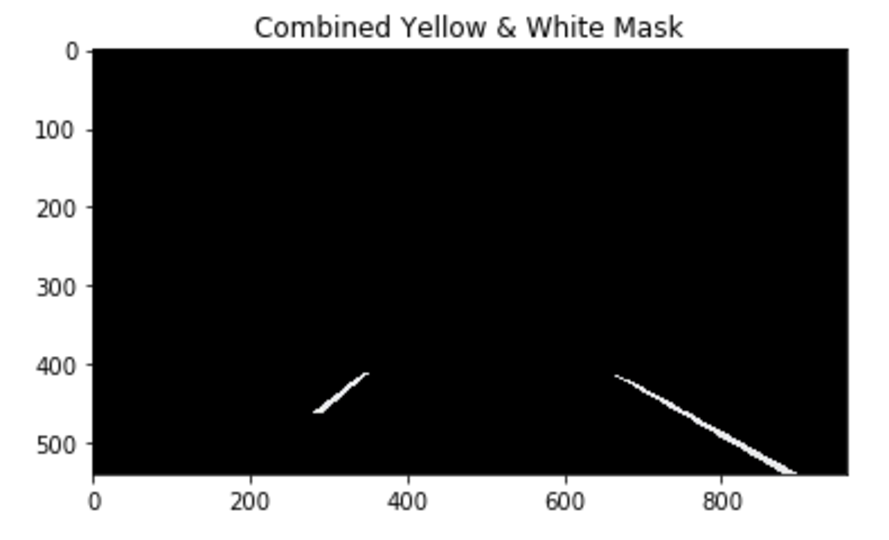
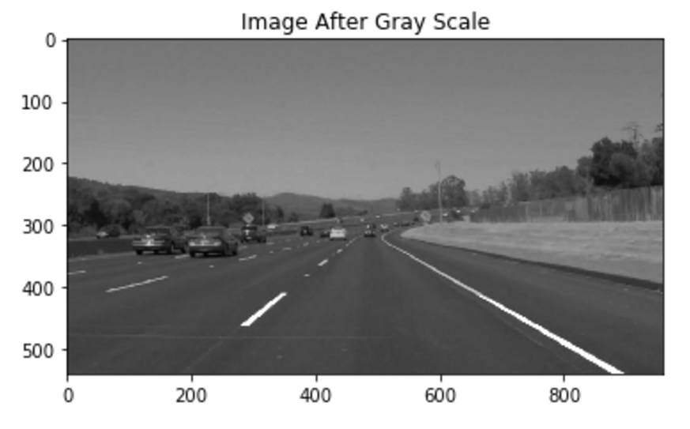
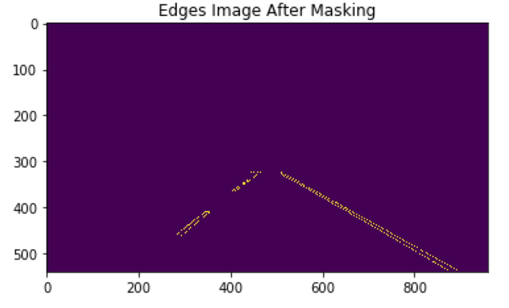

# **Finding Lane Lines on the Road** 



## Overview
When we drive, we use our eyes to decide where to go.  The lines on the road that show us where the lanes are act as our constant reference for where to steer the vehicle.  Naturally, one of the first things we would like to do in developing a self-driving car is to automatically detect lane lines using an algorithm.

In this project you will detect lane lines in images using Python and OpenCV.  OpenCV means "Open-Source Computer Vision", which is a package that has many useful tools for analyzing images.  

## Goals
The goals for this project were to:
•	Make a pipeline that finds lane lines on the road
•	Reflect on my work


## The Lane Finding Pipeline
The pipeline for this project has been separated into seven primary tasks as described in detail below.
The simplified pipeline outline in python can be seen below:
```python
def draw_lanes_on(image)
  polygon_mask_for_colours = region_of_interest(image, X_COL_OFFSET, Y_COL_OFFSET)
 	colour_weighted_image = colour_mask(image, polygon_mask_for_colours,
                                        yellow_hsv_threshold_low,yellow_hsv_threshold_high,
                                        white_hsv_threshold_low,white_hsv_threshold_high)
  gray_image = grayscale(colour_weighted_image)
  filtered_image = gaussian_blur(gray_image)
  edges_image = canny(filtered_image, low_threshold, high_threshold)
  masked_edges_image = region_of_interest(edges_image, X_CENTRE_OFFSET, Y_CENTRE_OFFSET)
  lines = hough_lines(masked_edges_image, rho, theta, threshold, min_line_len, max_line_gap)
  lanes_image = draw_lines(image, lines)
  return lanes_image
```
The following photos link to the processed videos using the current pipline:

Click on photo to see processed video for the solid right lane video.

<a href="http://www.youtube.com/watch?feature=player_embedded&v=y4rFJXo27B0
" target="_blank"></a> 


Click on photo to see processed video for the solid right lane video.

<a href="http://www.youtube.com/watch?feature=player_embedded&v=RRT0ptlltJA
" target="_blank"></a> 

Click on photo to see processed videos for the challenge.

<a href="http://www.youtube.com/watch?feature=player_embedded&v=XRVgT-Ude2U
" target="_blank"></a>

### Lane Colour Enhancement
This process was not initially included, however after attempting the challenge video the pipeline was not robust against yellow, and less robust for yellow or white lanes on light coloured bitumen.
This process uses a low and high threshold for both white and yellow in the HSV colour space. First the image is converted to HSV, then thresholds applied. 

After some testing with the colour thresholds it was found that other cars, particularly white ones, provide false positives and influence the lines. A strict mask was used to only enhance the yellow and white colour for the immediate road.



The yellow and white masks are added together and weighted against the original image.
More time will be spent on adjust the thresholds and weighting to the original image. It is suspected that the polygon mask can be increased, colour thresholds used over a wider band and rather than weighting against the initial image it could be passed directly to the next stage in the pipeline.
This would reduce some time taken in the pipeline.

### Convert image to grayscale
After the lane colours are enhanced the image is converted to gray scale such the Canny Edge detection can identify edges through pixel intensity.
at gaussian smoothing and edge detection can be performed.



### Gaussian smoothing
The image is smoothed such that edges are more pronounced and there is less individual pixels or noise in the image.

### Canny edge detection
The Canny Edge Detection uses rapid changes in gradient represented by brightness.  

### Mask image to get region of interest
A polygon mask is created using four vertices. These vertices remove features in the environment which may present as distractions from the lanes, for example over head bridges, electricity lines, the horizon, side verges, other lanes etc.



This is performed before the Hough transform to eliminate as many possible false positive lines.

### Hough Transform to obtain lines
The Hough Transform can be used to observe lines from  Image Space into the Hough Space by looking at gradients vs intercepts. Any point with intersecting lines in the Hough Space represents a single line in the Image Space.  
The parameters for the Hough Lines detection have been adjust to filter out as much noise as possible and leave only the lane lines behind for most cases.

### Process lines – Filtering, Averaging, Extrapolation
Once the lines have been identified, they are separated into left and right lanes depending on their gradient/slopes. Each lane is then processed separately.
First the points for each lane go through a rejection process based on the mean and how many standard deviations the points are away from the mean. Once outliers are rejected, the gradient and intercept are averaged. Using the average slope, intercept, minimum and maximum y values, the x coordinates are extrapolated. These coordinates are then added to a history array. 
The history array keeps track of previous coordinates for the left and right lanes. By storing a history of the past lane points, the next line can be compared to the previous lines. A rejection process is then performed again, if classified as an outlier it is discarded, if not it is averaged with the previous coordinates to smooth the location of the line. Several lengths of the array were trial 1,5,10,15,20. Increasing the history increases lag in the lane location, however its movement is smoother.
More experimentation is required, currently a history of 15 values is used. Other methods and available science and math tools should be considered for filtering the data.

## Potential shortcomings of the current pipeline
There are several shortcomings that have been noted for the current pipeline implementation.

### Shadows
The lane finding pipeline appears to suffer under a shadow in the challenge video as seen below. Investigating change in lighting conditions may highlight a short coming.


### Corners and Curves
The lane fitting is only suited to straight lines, it should be able to fit and predict curves.

### Other Cars In Front
If other cars were directly in front of the camera it may limit the use of the lane finding pipeline.

## Improvements to your pipeline
### Straight lines to Curves
The pipeline is restricted to extrapolating linear lanes. The pipeline should enable polynomial lines to be fitted to the lanes such that corners could be predicted.

### Filtering
The filtering method with currently used is not ideal. It’s been observed that the sample size for the number of lines detected is very low which will affect the confidence of the result. Other techniques will be considered to improve the filtering.

### History
The history of the past points will need further investigation to determine how much is required. Currently it is assumed that if 30 frames can be processed in a second, a 15 frame history may have half a second lag.
It also appears that until the history array is full there are issues in accuracy..

### Colour separation
It is thought that more focus on colour enhancement / separation could improve results further. However, during tests as the enhancement of the colour increased and opacity of original image decreased the results worsened. Further investigation required.

## Notes on setup

**Step 1:** Set up the [CarND Term1 Starter Kit](https://classroom.udacity.com/nanodegrees/nd013/parts/fbf77062-5703-404e-b60c-95b78b2f3f9e/modules/83ec35ee-1e02-48a5-bdb7-d244bd47c2dc/lessons/8c82408b-a217-4d09-b81d-1bda4c6380ef/concepts/4f1870e0-3849-43e4-b670-12e6f2d4b7a7) if you haven't already.

This did not work for me on windows, so I created my own environment.

You will need Python 3, numpy, matplotlib, OpenCV libraries and Jupyter Notebook Installed.
```python
conda create sdc python=3.6 anaconda
activate sdc
```
Make sure you have correct version of python
```python
>python --version
```
Install the relevent packages
```python
>conda install numpy
>conda install matplotlib
>conda install -c https://conda.anaconda.org/menpo opencv3
pip install moviepy
```
Test if successfully installed
```python
>python % to enter python 
>>>import cv2
>>>		% no error means success
>>>import moviepy
>>>   % no error means success
Ctrl+c %to exit python 
```
**Step 2:** Open the code in a Jupyter Notebook
Make sure you are in the same directly as the notebook and open it with the following.
```python
jupyter notebook
```
A browser will appear with contents of the current directory, click on p1-lane-line.ipynb to open the notebook.
Make sure the kernel is set to python3.
I had issues selecting which kernel to use, the following stpes helped enable python3 kernel.
Open terminal
```python
activate sdc
conda install notebook ipykernel
ipython kernel install --user
```
Reopen the notebook. Check that Python3 is being used.

Follow the instructions from the notebook

You will complete the project code in a Jupyter notebook.  If you are unfamiliar with Jupyter Notebooks, check out <A HREF="https://www.packtpub.com/books/content/basics-jupyter-notebook-and-python" target="_blank">Cyrille Rossant's Basics of Jupyter Notebook and Python</A> to get started.

Jupyter is an Ipython notebook where you can run blocks of code and see results interactively.  All the code for this project is contained in a Jupyter notebook. To start Jupyter in your browser, use terminal to navigate to your project directory and then run the following command at the terminal prompt (be sure you've activated your Python 3 carnd-term1 environment as described in the [CarND Term1 Starter Kit](https://github.com/udacity/CarND-Term1-Starter-Kit/blob/master/README.md) installation instructions!):

`> jupyter notebook`

A browser window will appear showing the contents of the current directory.  Click on the file called "P1.ipynb".  Another browser window will appear displaying the notebook.  Follow the instructions in the notebook to complete the project.  

